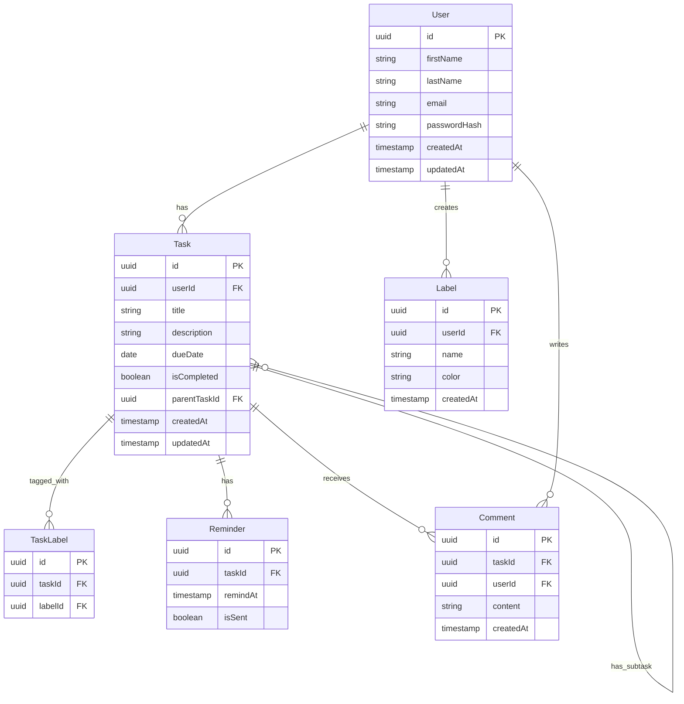

```mermaid
erDiagram
  User ||--o{ Task : has
  User ||--o{ Label : creates
  Task ||--o{ TaskLabel : tagged_with
  Task ||--o{ Reminder : has
  Task ||--o{ Comment : receives
  Task ||--o{ Task : has_subtask
  User ||--o{ Comment : writes

  User {
    uuid id PK
    string firstName
    string lastName
    string email
    string passwordHash
    timestamp createdAt
    timestamp updatedAt
  }

  Task {
    uuid id PK
    uuid userId FK
    string title
    string description
    date dueDate
    boolean isCompleted
    uuid parentTaskId FK
    timestamp createdAt
    timestamp updatedAt
  }

  Label {
    uuid id PK
    uuid userId FK
    string name
    string color
    timestamp createdAt
  }

  TaskLabel {
    uuid id PK
    uuid taskId FK
    uuid labelId FK
  }

  Reminder {
    uuid id PK
    uuid taskId FK
    timestamp remindAt
    boolean isSent
  }

  Comment {
    uuid id PK
    uuid taskId FK
    uuid userId FK
    string content
    timestamp createdAt
  }
```