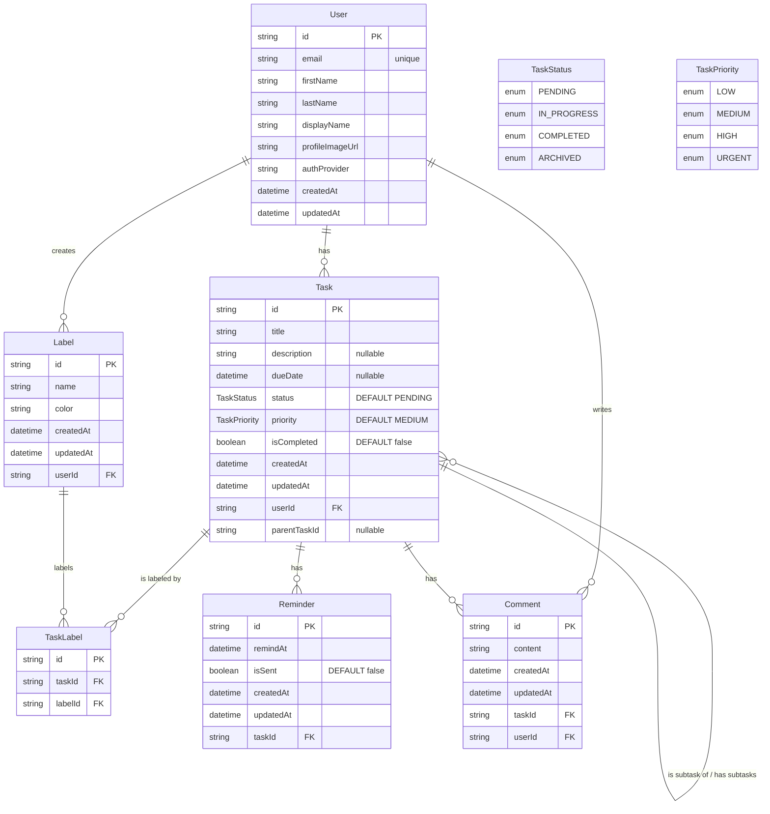

```mermaid
erDiagram

  User {
    string id PK
    string email "unique"
    string firstName
    string lastName
    string displayName
    string profileImageUrl
    string authProvider
    datetime createdAt
    datetime updatedAt
  }

  Task {
    string id PK
    string title
    string description "nullable"
    datetime dueDate "nullable"
    TaskStatus status "DEFAULT PENDING"
    TaskPriority priority "DEFAULT MEDIUM"
    boolean isCompleted "DEFAULT false"
    datetime createdAt
    datetime updatedAt
    string userId FK
    string parentTaskId "nullable"
  }

  Label {
    string id PK
    string name
    string color
    datetime createdAt
    datetime updatedAt
    string userId FK
    %% @@unique([name, userId]) ensures a user cannot have two labels with the same name
  }

  TaskLabel {
    string id PK
    string taskId FK
    string labelId FK
    %% @@unique([taskId, labelId]) ensures a task cannot have the same label applied multiple times
  }

  Reminder {
    string id PK
    datetime remindAt
    boolean isSent "DEFAULT false"
    datetime createdAt
    datetime updatedAt
    string taskId FK
  }

  Comment {
    string id PK
    string content
    datetime createdAt
    datetime updatedAt
    string taskId FK
    string userId FK
  }

  TaskStatus {
    enum PENDING
    enum IN_PROGRESS
    enum COMPLETED
    enum ARCHIVED
  }

  TaskPriority {
    enum LOW
    enum MEDIUM
    enum HIGH
    enum URGENT
  }

  User ||--o{ Task : "has"
  User ||--o{ Label : "creates"
  User ||--o{ Comment : "writes"

  Task ||--o{ TaskLabel : "is labeled by"
  Task ||--o{ Reminder : "has"
  Task ||--o{ Comment : "has"
  Task }o--|| Task : "is subtask of / has subtasks" 
  %%Self-referencing for parent/subtasks

  Label ||--o{ TaskLabel : "labels"
```